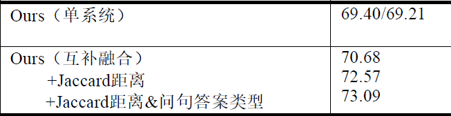

# CCKS2019-CKBQA
A system for CCKS2019-CKBQA

知识库链接（BaiduNetDisk）：链接: https://pan.baidu.com/s/1XSH-kkzGZa49uE9oFY-GpQ 提取码: 7e5z

## 知识库导入
1. mysql安装

mysql安装 参考网址：https://blog.csdn.net/tianpy5/article/details/79842888

允许远程访问设置：https://blog.csdn.net/h985161183/article/details/82218710

pymysqlpool安装参考网址：https://www.cnblogs.com/z-x-y/p/9481908.html

pymsql安装：pip install PyMysqlPool

## 预处理

1. dataset

    mkdir data

You can download train/dev/test from https://github.com/pkumod/CKBQA and put them into data/

2. preprocecss

    Preprocess.ipynb

对原始数据集（train/dev/test）进行预处理

## NER

1. 实体识别

    cd NER

    sh ccks_run.sh

2. 利用知识库进行优化，并进行实体链接
    实体识别的优化与实体链接

## 问句分类

    Please ignore the dir:Question_classification copy.
    It seems something wrong with git command.

    cd Question_classification/BERT_LSTM_word
    sh run.sh

## 语义相似度计算

    cd PathRanking/model
    sh train.sh

## 结果
Average F1：

