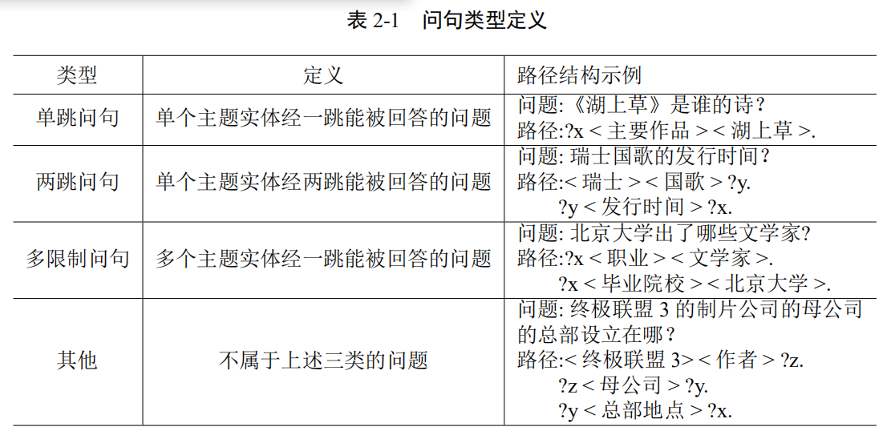

# CCKS2019-CKBQA
A system for CCKS2019-CKBQA

知识库链接（BaiduNetDisk）：链接: https://pan.baidu.com/s/1XSH-kkzGZa49uE9oFY-GpQ 提取码: 7e5z

## Dependency

    python 3
    pytorch==3.5
    pytorch-pretrained-bert==0.4

## 知识库导入

1. mysql安装

mysql安装 参考网址：https://blog.csdn.net/tianpy5/article/details/79842888

允许远程访问设置：https://blog.csdn.net/h985161183/article/details/82218710

pymysqlpool安装参考网址：https://www.cnblogs.com/z-x-y/p/9481908.html

pymsql安装：pip install PyMysqlPool

2. 知识库导入数据库

    follow KB/kb_processing.ipydb to create database

    useful instruction:

    查看总体数据库信息：show databases;

    创建数据库：create database ccks;

    选择要使用的数据库：use ccks;

    查看该数据库下的表的信息：show tables;
    
    查看表中数据个数：select count(*) from pkubase;
    
    查看表中最后6条数据：select * from pkubase order by id desc limit 0,6;
    
    查看当前使用的数据库名字：select database();
    
    查看表结构：desc pkuprop;
    
    sql创建表时的varchar(num)中的num表示字符个数而不是字节个数。
    
    更改密码：update mysql.user set authentication_string=password('yhjia') where user='root';
    

## 预处理

1. dataset

    mkdir data

You can download train/dev/test from https://github.com/pkumod/CKBQA and put them into data/

2. preprocecss

    Preprocess.ipynb

对原始数据集（train/dev/test）进行预处理，生成 NER/data/train_bert_ner_input.txt、valid_bert_ner_input.txt和test_bert_ner_input.txt文件用于对下一步NER模型的训练。

## NER

1. 实体识别

    cd NER
    
    mkdir snapshot

    sh ccks_run.sh

训练阶段将ccks_bert.cfg中的status字段改为train, 预测阶段改为tag。
生成的NER模型保存在snapshot/modelbest.pkl。

2. 利用知识库匹配分词

    python ws.py

生成的分词文件在data/questions_ws.txt

第一行是问句，第二行是正向最大匹配（知识库中的别名作为词表）的结果，第三行是实体匹配（知识库中的别名作为词表）的结果。

2. 利用知识库进行优化，并进行实体链接

    运行实体识别的优化与实体链接.ipynb
    生成data/test_er_out.json：用途
    生成data/test_er_out_baike.json：用途
    生成data/test_el_baike_top10.json：用途

## 语义相似度模型训练

### 生成训练数据

    cd PreScreen/preprocess/
    
    运行data.ipynb
    生成../../data/train.json和valid.json:实体链接模型的训练和验证数据

### 训练

    cd PathRanking/model/
    
    mkdir saved_sharebert_negfix
    
    sh train.sh
    生成的实体链接模型存放在saved_sharebert_negfix/pytorch_model.bin

## 问句分类模型训练

    cd Question_classification/BERT_LSTM_word
    sh run.sh

## 预测部分

## 方法1：基于问句分类的方法

本方法先对问句进行分类，再检索当前类别的路径，最后经过语义相似度匹配模型

## 问句分类

    to do
    
## 方法2：基于集束搜索的方法

本方法基于路径跳数不大于2的假设，每一跳会保留topk个最优的当前路径

### 预测部分(to do 文件夹结构比较混乱，待优化)

# 已经训练好了语义相似度匹配模型

# step1:搜索一跳路径

    cd PreScreen/data/
    python onehop_path.py
    生成./one_hop_paths.json

# step2:预测topk一跳路径
    
    mkdir /PreScreen/data/merge
    
    cd PathRanking/model/
    
    sh predict_stage1.sh
    生成PreScreen/data/merge/one_hop_predict_path.json:用途

# step3:搜索两跳路径

    cd PathRanking/model/
    sh search_path_stage2.sh
    生成PreScreen/data/merge/mix_paths.json：用途
    生成PreScreen/data/merge/mix_paths_all.json：用途
    
# step4:预测一跳两条混合的所有路径中的topk

    cd PathRanking/model/
    
    sh predict_stage2.sh 注：把此处的输入文件paths_all_merge.json更名为上一步search_path_stage2.sh生成的mix_paths_all_merge.json
    生成PreScreen/data/merge/mix_predict_path.json

# step5：检索最后的答案

    cd PreScreen/data/
    sh search_ans.sh
    生成PreScreen/data/merge/mix_answer.json：用途

# step6：检验预测结果

    # 注意修改答案文件路径
    evaluation_answer.ipynb    

## 结果
Average F1：

